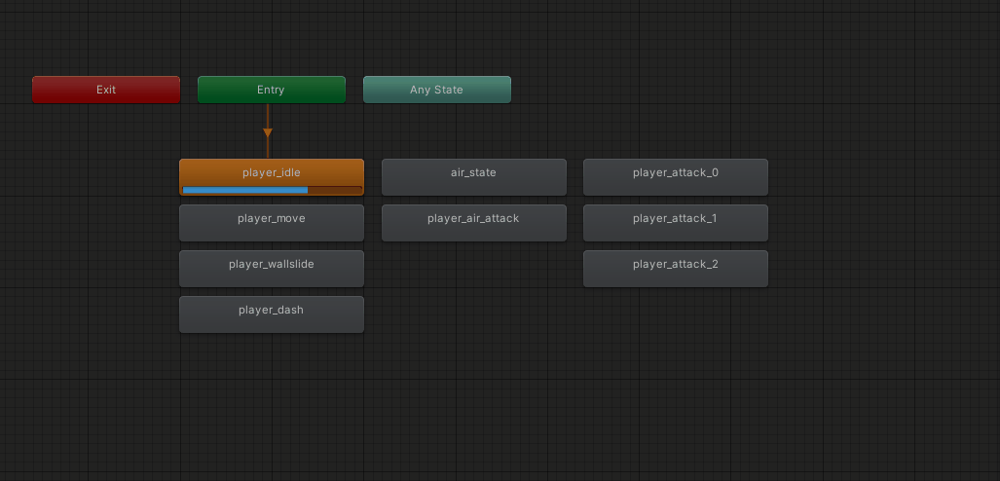
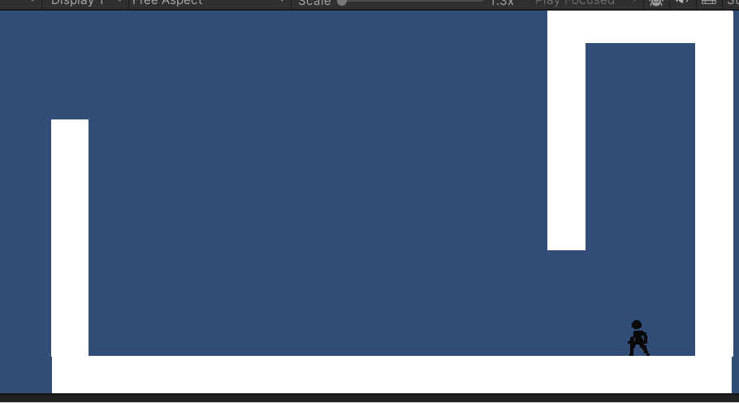
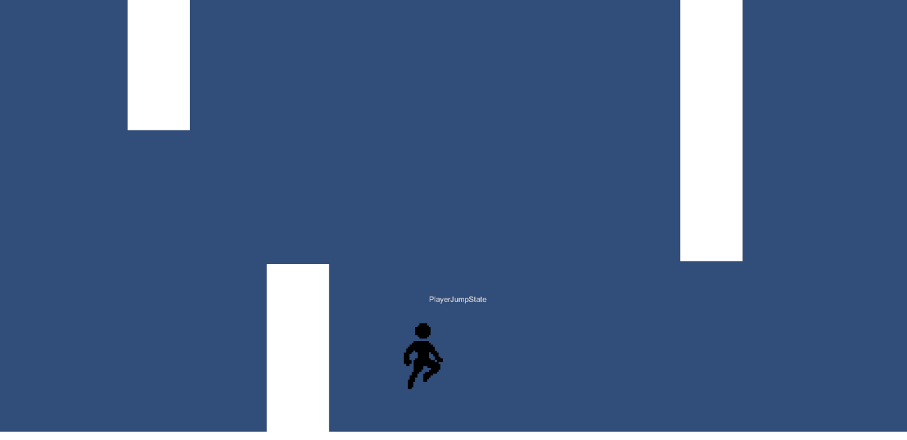
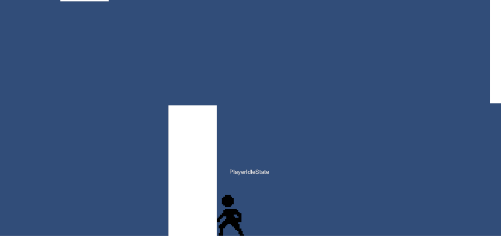
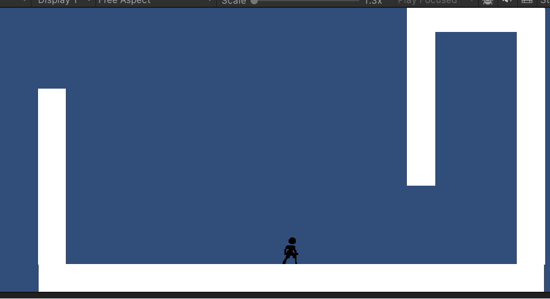

# FSM + New Input System + Animations.

This repo contains an example of a Finite state machine, using the new Input System, and added Animations to it.

`Feel free to fork and do pull requests to make it better`

* The asset for the player used is [2D Pixel Art Character Template Asset Pack](https://zegley.itch.io/2d-platformermetroidvania-asset-pack), I've put only a small amout of them, and recolored it to black, I urge you to buy it! It's awesome!

* Currently its fit specifically for a platformer.

## Current States:

1. Idle State
2. Move State
3. Jump State
4. Fall State
5. Dash State
6. Wall Slide State
7. Wall Jump State
8. Attack State + Attack Combo
9. Player Air Attack
10. Player Edge Grab

### `Clean State Machine Animator`

### `Wall Jump & Slide`

### `Dash & Air Dash`

### `Air Attack`

### `Ledge Grab`

### `Attack + Combo Attack (Extendable)`

## Todo:
1. Double Jump
